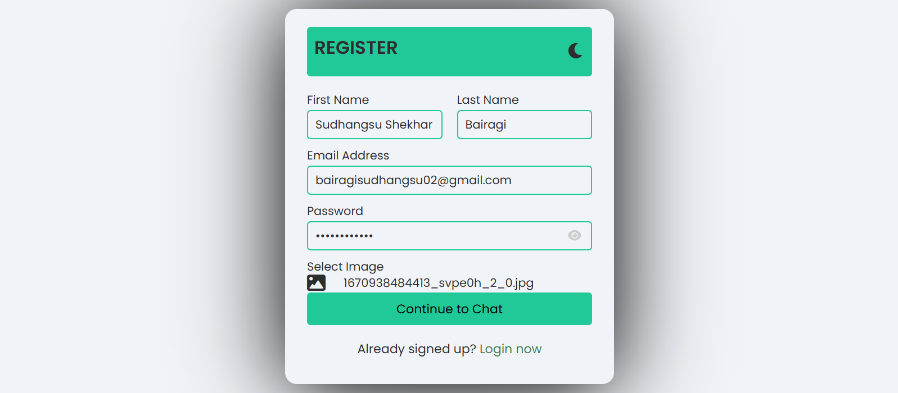
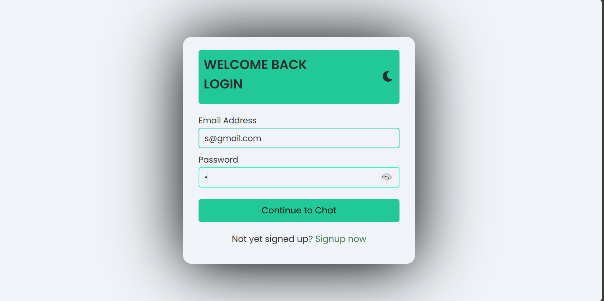
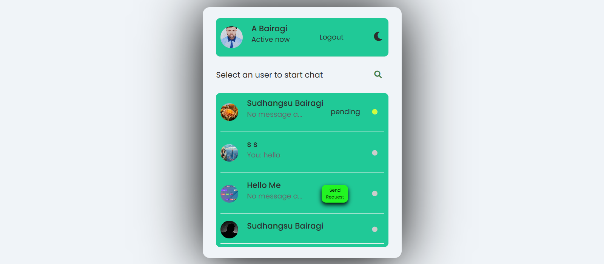
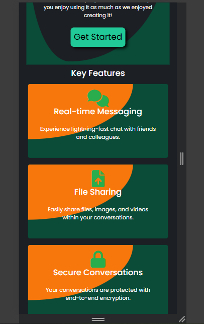
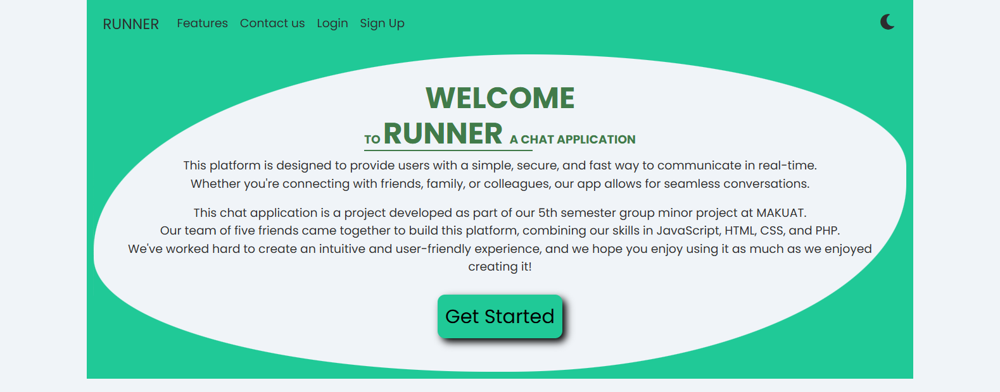
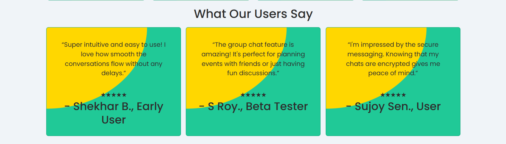
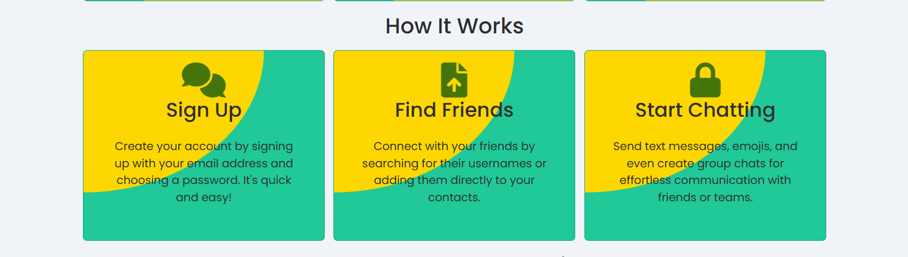
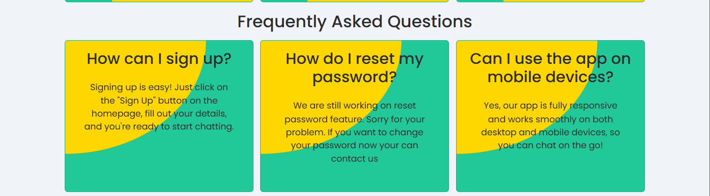
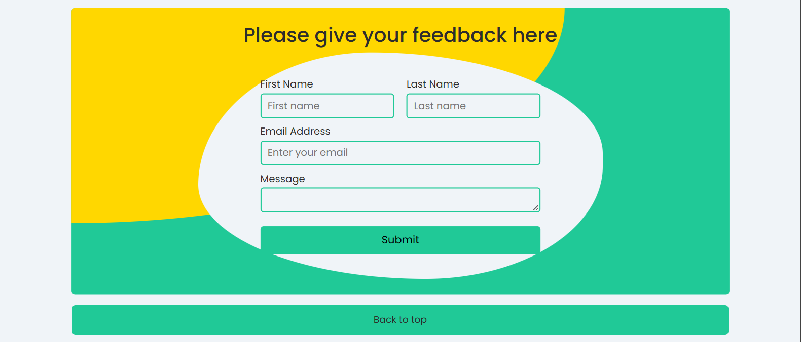

# Chat-Application
A real-time chat application built using HTML, CSS, JavaScript, PHP, and MySQL.
# Features
- User authentication (Sign up & Login)

- Real-time messaging

- Online user status
 
- Responsive design
 
- Secure database storage
- AJAX-based messaging (without page reload)
# Technologies Used
- Frontend: HTML, CSS, JavaScript (AJAX)
- Backend: PHP
- Database: MySQL
- Server: Apache (XAMPP)
# Home Page

